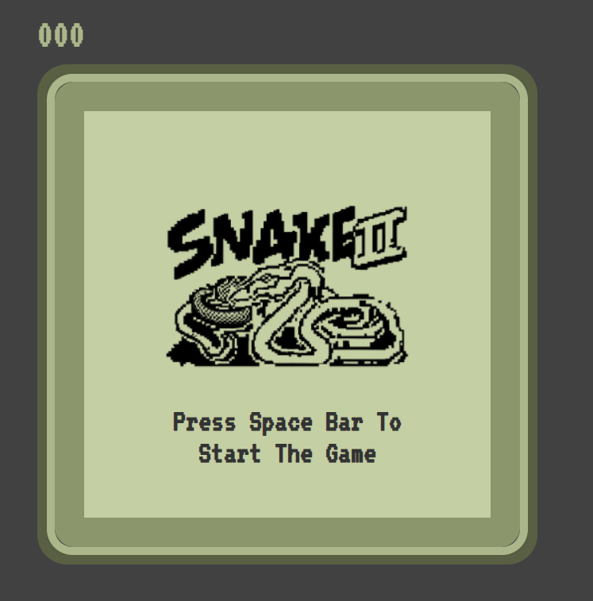

## About

🐍 Welcome to the Snake Game!

This project brings back the classic Snake game we all loved from the early days of mobile phones. Developed using HTML, CSS, and JavaScript, this game offers a nostalgic gaming experience with a modern touch.

### Features
- 🎮 Responsive and intuitive controls
- 🍎 Score tracking and high score display
- 🌐 Endless gameplay for endless fun

### Technologies Used
- HTML
- CSS
- JavaScript

### How to Play
Navigate the snake using the arrow keys, eat the food to grow, and avoid collisions with walls and your own tail. Challenge yourself and see how high you can score!

### Demo
Check out the live demo [here](https://yashwanth2000.github.io/snake-game/).

### Screenshots

### Installation
Clone the repository and open the `index.html` file in your web browser to start playing.

### Acknowledgments
Special thanks to the creators of the classic Snake game for inspiring this project.

---
Enjoy the Snake Game and happy gaming! 🎉
